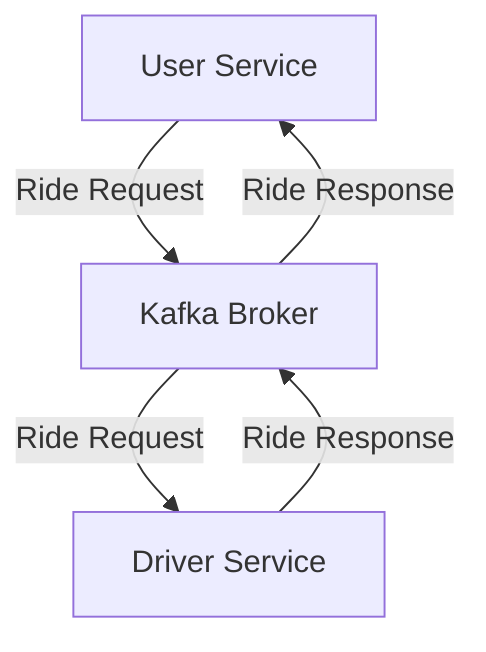

# Kafka User-Driver Application

The Kafka User-Driver Application is a real-time cab booking system that leverages Apache Kafka for efficient communication between users and drivers. This application demonstrates how to utilize Kafka's distributed streaming capabilities to manage user requests and driver responses in a scalable and reliable manner.

## Table of Contents

- [Overview](#overview)
- [Architecture](#architecture)
- [Prerequisites](#prerequisites)
- [Installation](#installation)
- [Usage](#usage)
- [Contributing](#contributing)
- [License](#license)

## Overview

In this application, users can send ride requests, and drivers can accept these requests. Apache Kafka serves as the messaging backbone, facilitating seamless communication between users and drivers. This setup ensures real-time processing and handling of ride requests, providing a responsive experience for both parties.

## Architecture

The application's architecture consists of the following components:

- **User Service**: Allows users to request rides. It publishes ride requests to a Kafka topic.
- **Driver Service**: Listens to the Kafka topic for incoming ride requests. Drivers can accept requests, and their responses are sent back through Kafka topic.
- **Kafka Broker**: Acts as the intermediary, managing the topics and ensuring messages are delivered between the User and Driver services.

Below is a high-level diagram illustrating the interaction between these components:



## Prerequisites

Before running the application, ensure you have the following installed:

1. **Java Development Kit (JDK)**:
   - Minimum version: 8
   - Ensure `JAVA_HOME` is set correctly in your system's environment variables.

2. **Apache Kafka**:
   - Kafka must be installed and configured on your machine.
   - Download from [Apache Kafka Downloads](https://kafka.apache.org/downloads).

3. **Apache Maven**:
   - Use Maven to build and run the project.
   - Download from [Apache Maven Downloads](https://maven.apache.org/download.cgi).

4. **Git**:
   - Required to clone the repository.
   - Download from [Git Downloads](https://git-scm.com/downloads).

## Installation

### Installation on Windows

1. **Install Prerequisites**:
   - Install JDK, Kafka, Maven, and Git as per the instructions on their respective websites.
   - Ensure `JAVA_HOME` and `MAVEN_HOME` are set in environment variables.

2. **Clone the Repository**:
   ```bash
   git clone https://github.com/Nirbhay007/kafka-user-driver-app.git
   cd kafka-user-driver-app
   ```
3. **Start Kafka**:

- Open a terminal in the Kafka installation directory.
- Start Zookeeper:
```bash
#Copy code
.\bin\windows\zookeeper-server-start.bat .\config\zookeeper.properties
```
- Start Kafka Broker:
```bash
#Copy code
.\bin\windows\kafka-server-start.bat .\config\server.properties
```
- Build the Project:

```bash
#Copy code
mvn clean install
```
4. **Installation on macOS**
- Install Prerequisites:

- Install JDK via AdoptOpenJDK or using brew:
```bash
#Copy code
brew install openjdk
#Install Kafka and Maven using brew:
```
```bash
#Copy code
brew install kafka maven
```
5. **Clone the Repository**:

```bash
#Copy code
git clone https://github.com/Nirbhay007/kafka-user-driver-app.git
cd kafka-user-driver-app
```
6. **Start Kafka**:

- Open a terminal and start Zookeeper:
```bash
#Copy code
zookeeper-server-start.sh /usr/local/etc/kafka/zookeeper.properties
```
7. **Start Kafka Broker**:
```bash
#Copy code
kafka-server-start.sh /usr/local/etc/kafka/server.properties
```
8. **Build the Project**:

```bash
#Copy code
mvn clean install
```
- Common Issues
9. **Port Conflicts**:

- Kafka defaults to port 9092, and Zookeeper defaults to 2181. Ensure these ports are free before starting Kafka.
10. **Environment Variable Errors**:

- Ensure JAVA_HOME, MAVEN_HOME, and PATH are set correctly. You can verify by running:
```bash
#Copy code
java -version
mvn -version
```
- Broker Not Starting:

- Check Kafka logs for errors. Common issues include incorrect configurations in server.properties.
11. **Dependency Errors**:

- If Maven fails to build the project, ensure your internet connection is active to fetch dependencies.
12. **Insufficient Memory**:

- Kafka requires sufficient memory to run. Adjust Java heap settings in Kafka's startup scripts if you encounter memory issues.
